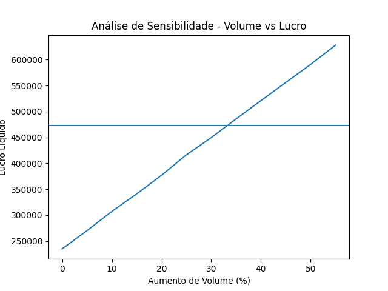

## Simulação de Elasticidade de Preço e Impacto no Lucro Líquido

**1. Contexto de Negócio** 

Uma loja de roupas femininas com faturamento médio mensal de aproximadamente **R$ 120.000** opera com markup médio de **3,0x**
sobre o custo. Nos últimos meses, foi observada uma queda gradual no volume de vendas, possivelmente associada a:
  
•	Aumento da concorrência;  
  
•	Maior sensibilidade a preço;  
  
•	Redução do poder de compra dos consumidores.  
  
Diante desse cenário, a gestão considera reduzir preços como estratégia para recuperação de volume.

**2. Problema de Negócio**  

A questão estratégica analisada neste projeto é: **Uma redução no markup pode aumentar o lucro líquido absoluto, mesmo com menor margem unitária?**  

Essa decisão impacta diretamente:  

•	Política de precificação;  
  
•	Posicionamento competitivo;  
  
•	Sustentabilidade financeira;  
  
•	Estrutura de rentabilidade.  
    

**3. Premissas do Modelo**

Estrutura de preço: 

•	Markup atual: 3,0x 

•	Markup proposto: 2,5x (Redução aproximada de preço de 16,7%)  

Elasticidade da demanda:  

•	Elasticidade-preço assumida: **-1,5**  

•	Dinâmica: Para cada 1% de redução no preço, o volume aumenta 1,5%.  

•	Aumento estimado de volume: 25%.  

Operação:  

•	Volume base: **500 vendas/mês**.  

•	Custos fixos mensais: **R$ 40.000,00** (mantidos constantes na simulação).  

Dados simulados com base em **parâmetros realistas** do varejo.  

**4. Hipótese Testada**

**"A redução do markup para 2,5x aumentará o volume de vendas o suficiente para elevar o lucro líquido absoluto anual."**

**5. Metodologia**  
  1.	Geração de base transacional simulada para 12 meses;  
  2.	Cálculo de receita, custo total, lucro bruto e lucro líquido;  
  3.	Aplicação de elasticidade da demanda;  
  4.	Análise de sensibilidade variando o aumento percentual de volume;  
  5.	Identificação do ponto de equilíbrio (break-even).  

**6. Métrica Principal**  

Lucro Líquido Absoluto (R$)  

A comparação é feita entre:  

• Cenário base (markup 3,0x)  

• Cenário reduzido (markup 2,5x)

**7. Principal Resultado**  

A simulação demonstrou que o lucro líquido apenas supera o cenário base quando o volume de vendas aumenta acima de aproximadamente **35%**.  
Isso indica que a **elasticidade necessária para viabilizar a estratégia deve ser superior** à inicialmente assumida (-1,5), que previa um aumento de apenas 25%.

**8. Conclusão Estratégica**  

A redução de preço não garante aumento de lucro. Para que a estratégia gere valor, o aumento de volume deve compensar integralmente a queda de margem.  
Caso contrário, a empresa aumenta vendas, mas reduz lucro absoluto, caracterizando destruição de valor econômico.

**9. Tecnologias Utilizadas**

•	Python  
•	Pandas e NumPy (Processamento de dados)  
•	Matplotlib (Visualização)  

**10. Riscos e Considerações Estratégicas**  

A decisão envolve riscos adicionais não capturados integralmente no modelo:  

•	**Necessidade de aumento de custos fixos:** Um aumento significativo de volume pode exigir contratação de funcionários, expansão de 
  espaço ou maior investimento em logística.  
    
•	**Aumento da necessidade de capital de giro:** Maior volume implica mais estoque e compras, o que pode pressionar o fluxo de caixa.  
  
•	**Dificuldade de retorno ao preço anterior:** Reduções de preço podem alterar a percepção de valor da marca, tornando a estratégia 
  potencialmente irreversível.
